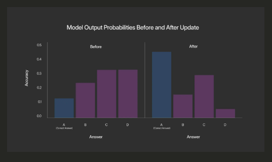
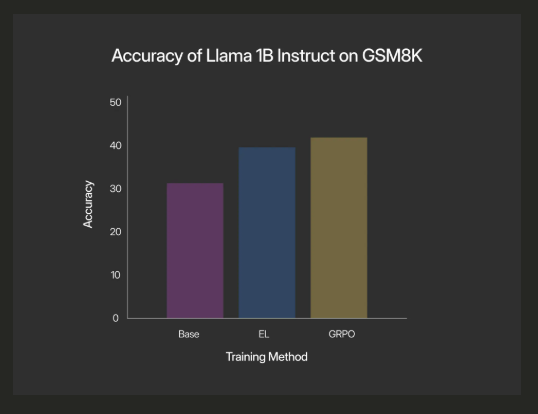

## Introduction

In recent work, Silver and Sutton (2025) wrote about what they call “The Era of Experience”. This is a pivot away from a reliance on mimicking human data and towards “experience”, defined as trajectories of actions, observations, and rewards. In a sense, what we’ve seen with DeepSeek R1, the OpenAI o-series, Claude 3.7 Sonnet, and the latest Gemini models are the first step in this direction by adopting reinforcement learning with verifiable rewards (RLVR) to develop reasoning abilities in constrained environments like math and code (Deepseek-AI, 2025; El-Kishky et al., 2024; Anthropic, 2025; Shao et al., 2024).

Similarly, there have been preliminary forays into applying similar concepts in less obviously verifiable domains, but that instead have gold standard completions. Using the completion of the next chapter of a story as a task, it’s been demonstrated that you can use the improvement in per-token perplexity from including reasoning traces, known as verifiable rewards - completion likelihood improvement (VR-CLI), as reward signal to improve reasoning abilities as well (Gurung & Lapata, 2025). Likely over the coming months we will see this extended to other domains with gold standard completions like multi-turn chat, and pretraining on certain document types.

The results with both RLVR and VR-CLI are excellent. RLVR in particular changed the model frontier overnight, and both demonstrate the wisdom in what Silver & Sutton say about the “Era of Experience”. However, as we see things playing out today, even these approaches present a handful of problems. The first is that the reward formulation and measurement are hopelessly intertwined with the construction of the environments themselves and do not generalize. While VR-CLI creates what feels like a general reward construction, its requirement of gold standard completions rules out many of the real-world use cases that would make the “Era of Experience” so powerful. All things considered, the overwhelming majority of valuable tasks lack easily verifiable completions or gold standard completions. The second is that overdoing RLVR can create very odd and jagged intelligences, as has been seen with ChatGPT o3 hallucinating running code on a MacBook, Sonnet 3.7 attempting to hardcode test response values, and Qwen3 having very weak knowledge with strong reasoning and a distaste for following system prompts over user messages. These issues all likely stem from the same root causes: RLVR is hyperfocused optimization on whatever the verifiable domain is and doesn’t tell you how your attempt was wrong and so there is an incentive to hallucinate reasoning for problems you cannot figure out. The third is that everything is reduced to scalar values, which destroys lots of valuable information. In Silver & Sutton’s (2025) work, they discuss ideas like a series of agents optimized for varying, directly measurable rewards, but acknowledge that this defeats the purpose of a unified general intelligence. To alleviate that, they then suggest a separate neural network that takes the agent’s actions, the environment information, and information from the user to output a scalar reward to guide the behavior of the agent. This seems similarly antithetical to the concept of a unified general intelligence. Why must there be a separation between the general intelligence and the evaluation of the quality of actions? Why must all signal be reduced to a scalar? To demonstrate why this reduction to a scalar is antithetical to high-quality signal extraction from the environment, think about writing code with a mistake in it and attempting to run it. You don’t just see a binary success/failure. Instead, the compiler or the runtime provides a detailed error and traceback that provides an extremely clear and high-fidelity signal about what went wrong in the original attempt. This is clearly superior.

What we want, then, is a generalized framework to distill this sort of high-fidelity, high-dimensional signal (that lives in token-space) into weight updates that make directed and relevant changes to how the model thinks.

## Related Works

This work on experiential learning is influenced by Silver & Sutton’s “The Era of Experience” paper (2025), Gurung and Lapata’s “Learning to Reason for Long-Form Story Generation” (2025), which introduced VR-CLI, and Ruan et al.’s “Reasoning to Learn from Latent Thoughts” (2025), which found that by including a post-facto reasoning step synthesizing the just seen data and attempting to recover a bit of the thought process that went in to generating the just seen data you can improve the learning efficiency. The foundational idea of treating reasoning as a latent variable problem is further explored in works like “Amortizing Intractable Inference in Large Language Models”, which categorizes optimization approaches into reward maximization or distribution matching (Hu et al., 2023). Our work on Experiential Learning, while not strictly RL, draws inspiration from the idea of effectively shaping and learning from these latent processes.

It is also important to note that when discussing “Reasoning to Learn from Latent Thoughts” and every mention of “latent” throughout this article, it is meant in the purely statistical form of “latent with respect to the data generation process”. “Latent thoughts” is often colloquially used to refer to hidden states of models, but that is not how it is used here.

## Methods

Experiential learning can be defined as taking a token-space representation of some experience, whether that is user feedback, environment feedback, or something else, and extracting learning signal from it to make relevant weight updates such that the behavior of the model is improved in similar situations in the future. This approach is neither RL, nor standard SFT, although it draws ideas from both.

## Experiments

To measure the validity and performance of the experiential learning framework (EL), we performed three experiments of increasing reasoning and feedback complexity. Due to GPU constraints, all experiments were run on Llama 3.2 1B or 1B Instruct.

In the first, we wanted to simply confirm that the signal derivation and learning approach optimized the output of the model in the expected way. For this we selected MMLU questions that 3.2 1B had gotten incorrect, measured the initial probability distribution across answers, generated an explanation of why that answer was wrong and the right answer was right using GPT-4o-mini (this is the “experience”), applied the EL method, and then re-measured the probability distribution across answers. This is an excellent scenario to initially test the behavior of EL because while MMLU is an outdated and fairly weak benchmark, it provides an easily interpretable playground to watch how the optimization via experience works. To get a representative sense of EL behavior, we tried explanations that included the correct answer, included the correct answer and a lengthy explanation, that did not include the correct answer letter but did include a lengthy explanation, and that gave an incorrect answer as the correct answer.

The second experiment was on code generation. We performed Monte Carlo cross-validation of improvements on HumanEval with 3.2 1B Instruct. This was done without chain-of-thought reasoning, so zero-shot attempts to complete the function. We examined three variations of experience signals. The first was showing the model the testing code that was run, whether or not the tests passed, and tracebacks from failing tests if there were any. For the second, we generated functions that replaced the tests with print statements showing the input/output pairs of running the function from the model’s completion. And the third was again using GPT-4o-mini to generate an explanation of what went wrong and how to make the code better.

The third experiment was on math with chain-of-thought. We first measured 3.2 1B Instruct’s performance on the GSM8K test set (with a max output token count of 256). Then, we randomly selected 256 examples from the GSM8K training set, generated attempted completions, generated explanations of why the completion was wrong if it was wrong, how to make it more elegant if it was right but sloppy, and otherwise just say it was right using GPT-4o-mini, applied EL, and then re-measured the performance on the test set. For this experiment, we also ran a baseline using GRPO to see how EL holds up in an environment where RLVR excels.

## Results

For the MMLU experiment, we saw substantial increases in the probability of the correct answer in the formulations that included the correct answer, the valid explanation, or both. For showing the correct answer, the true answer probability increased from 10.8% to 50.4%. When we gave the correct answer and the valid explanation, the true answer probability increased from 10.8% to 35.2%, and notably did not become the highest probability answer. And when we gave just the valid explanation, the true answer probability increased from 10.8% to 45.3%, as shown in the plot below. In the formulation where the model was shown the incorrect answer letter as its “experience”, the probability of this incorrect answer increased from 33.2% to 73.4%, as one would expect if the experience is being properly treated as grounded feedback.

It was interesting that providing explanations hurt the performance relative to just giving the correct answer. Part of that may simply be a byproduct of the fact that how the learning signal is derived is more amenable to scenarios where there is reasoning or a process to reaching the output, and MMLU is not that. Another explanation could be that the explanation is a noisy signal and therefore needs to be denoised either through an improved EL process or by combining these updates into a sufficiently large batch size such that the noise cancels out and just an accurate approximation of the true gradients remains. We apply the latter approach to the GSM8K experiment by using an effective batch size of 128.

In the HumanEval experiment, we measured average improvement with Monte Carlo cross-validation (5 repeats, 50% train / 50% test split). In the formulation where the “experience” is seeing the tests, there was an average improvement of 15.37% accuracy on the test set after EL. In the formulation where the “experience” is seeing the input-output pairs printed, there was an average improvement of 17.6% accuracy on the test set after EL. Like in the MMLU case, the GPT-4o-mini explanation underperformed. It resulted in highly inconsistent results. Sometimes it improved the accuracy by almost 50%, but sometimes it reduced accuracy.

GSM8K with chain-of-thought is an excellent arena to see how well EL works. There is a much larger surface area for optimization of outputs between the chain-of-thought and the final answer, and there are simple-to-set-up, high-performance training methods to compare to. The baseline performance of 1B Instruct with no training was measured at 30.4% accuracy on the test set, after training with EL, it was measured at 39.8%, and after training with GRPO, it was measured at 41.6%. Despite not outperforming GRPO, this is still an extremely positive result. EL doesn’t innately get clear directional logit advantages in the same way you get with GRPO, its optimization is much more indirect. But also, it’s an acceptable decrease in performance (especially since the method is still under development), given that EL is not constrained to verifiable domains with carefully constructed environments like GRPO is. The method is general and can be applied to any scenario in which experiences can be represented in token space.

## Conclusion

Given the small model size and the relatively limited scale of the experiments, the current findings are best considered preliminary. Should these initial observations continue to be validated, they represent highly promising early steps. Such progress could contribute to realizing the vision outlined by Silver and Sutton (2025) in "The Era of Experience," where experience becomes the "dominant medium of improvement." Naturally, there are reasons for caution regarding the broader applicability of these observations. It is fairly well established that an effective minimum model size for high-quality reasoning and understanding hovers around 7 billion parameters; 1 billion is a significant distance from that benchmark. Furthermore, it remains to be demonstrated that experiential learning can surpass reinforcement learning from verifiable rewards, and whether noisy language can serve as an effective experience signal without necessitating enormous effective batch sizes.

Despite all of that, the potential is exciting. Models will be able to learn user writing styles, coding styles, and preferences for research report structure; preliminary forms of in-weight memory can even be formed. Outputs of tools can now also provide vectors for models to continuously learn how to better complete tasks and more effectively use the tools at their disposal. Additionally, combining this with the learning approaches in Ruan et al. (2025) could prove extremely powerful in converting models from inert tools to dynamic, continuous learning entities via active inference. Indeed, the horizon EL opens is not just one of better models, but of AI that learns and reasons in a fundamentally more natural and robust way. This work suggests we are on the verge of moving beyond models that simply mimic static datasets towards those that genuinely adapt and evolve through the richness of their ongoing interactions. This aligns with Silver & Sutton's (2025) call for agents with “their own stream of experience that progresses... over a long time-scale.” However, a pure RL formulation for such agents often implies the need for incredibly complex synthetic environments for effective policy development. Experiential Learning offers a potentially more tractable path by inferring behavioral updates more directly from contextual experiences, thereby sidestepping the need for exhaustive trial-and-error in meticulously crafted environments.

Lastly, EL's current formulation, by enabling models to directly internalize and learn from rich, contextual experiences (as our results with varied feedback types demonstrate), has us thoroughly convinced: models are actually reasoning. It appears we have all just been training them in a way that constrains their capabilities. By empowering models to learn from these kinds of deeply contextualized inputs, which can reflect real-world interactions and feedback, EL offers a path to break free from simply being an “echo chamber of existing human knowledge,” as Silver & Sutton (2025) warn.

## Next Steps

First and foremost, these experiments need to be scaled to larger models and more interesting scenarios, especially those that fall outside the scope of what RLVR can do as well, particularly by testing across more substantial and modern benchmarks. At the same time, the EL approach should be polished and iterated upon. We need to be able to handle more noisy signals like long explanations without relying on very large effective batch sizes, as those hurt the number of gradient updates you can do and hurt the frequency at which you could perform model updates in a real-world scenario using user feedback as experiences. If accomplished, this will have the added benefit of broadly improving data efficiency, which hopefully will be sufficient to surpass RLVR even in environments where it excels.

## References

[1.] Anthropic. Claude 3.7 Sonnet and Claude Code, 2025. URL https://www.anthropic.com/news/claude-3-7-sonnet

[2.] Deepseek-AI. DeepSeek-R1: Incentivizing Reasoning Capability in LLMs via Reinforcement Learning. arXiv preprintarXiv:2501.12948, 2025.

[3.] Ahmed El-Kishky, Daniel Selsam, Francis Song, Giambattista Parascandolo, Hongyu Ren, Hunter Lightman, Hyung Won Chung, Ilge Akkaya, Ilya Sutskever, Jason Wei, Jonathan Gordon, Karl Cobbe, Kevin Yu, Lukas Kondraciuk, Max Schwarzer, Mostafa Rohaninejad, Noam Brown, Shengjia Zhao, Trapit Bansal, Vineet Kosaraju, and Wenda Zhou. OpenAI o1 System Card, 2024. URL https://openai.com/index/openai-o1-system-card/

[4.] Alexander Gurung, and Mirella Lapata. Learning to Reason for Long-Form Story Generation. arXiv preprint arXiv:2503.22828, 2025.

[5.] Edward J. Hu, Moksh Jain, Eric Elmoznino, Younesse Kaddar, Guillaume Lajoie, Yoshua Bengio, and Nikolay Malkin. Amortizing Intractable Inference in Large Language Models. arXiv preprintarXiv:2310.04363, 2023.

[6.] Yangjun Ruan, Neil Band, Chris J. Maddison, and Tatsunori Hashimoto. Reasoning to Learn from Latent Thoughts. arXiv preprintarXiv:2503.18866, 2025.

[7.] Zhihong Shao, Peiyi Wang, Qihao Zhu, Runxin Xu, Junxiao Song, Xiao Bi, Haowei Zhang, Mingchuan Zhang, Y.K. Li, Y. Wu, and Daya Guo. DeepSeekMath: Pushing the Limits of Mathematical Reasoning in Open Language Models. arXiv preprintarXiv:2402.03300v3, 2024.

[8.] David Silver, and Richard S. Sutton. The Era of Experience, 2025. URL https://storage.googleapis.com/deepmind-media/Era-of-Experience%20/The%20Era%20of%20Experience%20Paper.pdf
