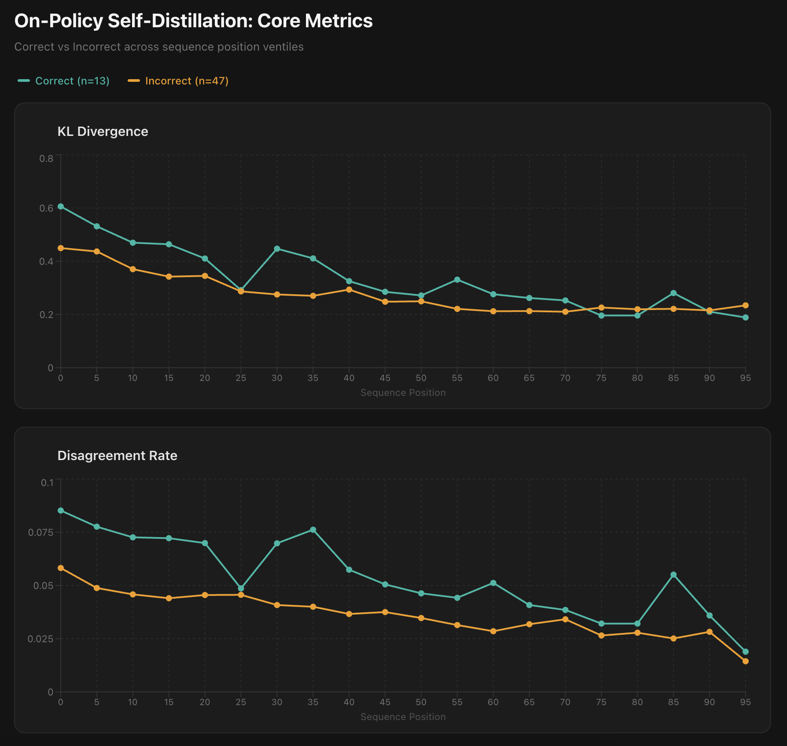
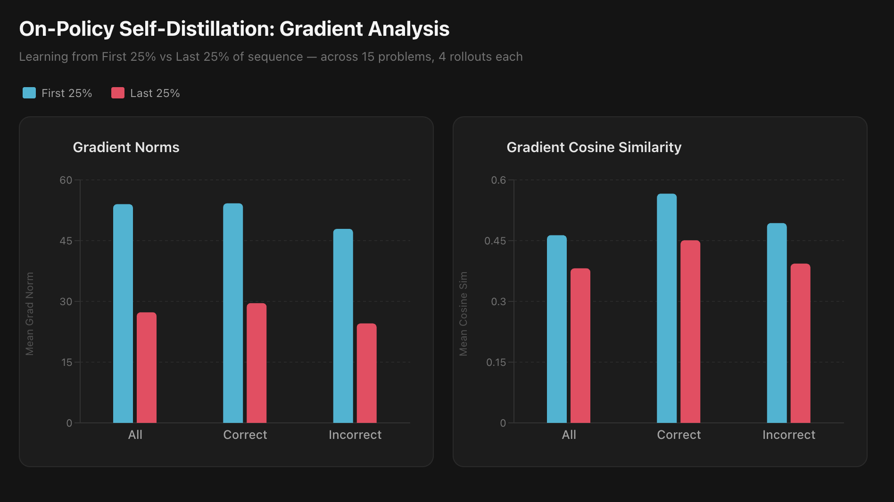

### Introduction

I've spent most of the past year investigating various methods to achieve continual learning [4], so I was intrigued when on-policy distillation began gaining momentum as a potential suitor over the past several months and wanted to investigate more deeply what it's actually doing mechanically. It was first brought back into focus via a blog post from Thinking Machines as a potential counter to some of the weaknesses of the current training meta for LLMs [3]. Namely, the lack of dense token-level supervision and the low number of bits of supervision per episode in RLVR via methods like GRPO [6], and the train-test gap issues of SFT and off-policy distillation.

In on-policy distillation, given a dataset of prompts $\mathcal{D}$, a student model $\pi_\theta$, and a teacher model $\pi_T$, the student samples a completion $y \sim \pi_\theta(\cdot \mid x)$ for each prompt $x \in \mathcal{D}$. The teacher then provides a token-level distribution at each position $t$ conditioned on the prompt and the student's prefix $y_{<t}$. The on-policy distillation objective minimizes:

$$\mathcal{L}_{\text{OPD}} = \mathbb{E}_{x \sim \mathcal{D},\; y \sim \pi_\theta(\cdot \mid x)} \left[ \sum_{t=1}^{|y|} D_{\text{KL}}\!\left( \pi_\theta(\cdot \mid x, y_{<t}) \;\|\; \pi_T(\cdot \mid x, y_{<t}) \right) \right]$$

More recently, a sub-field of on-policy distillation has begun to emerge, on-policy self-distillation [2, 7]. In the self-distillation variant, the student and teacher share the same weights $\theta$. The teacher is distinguished only by receiving privileged context $c$ — such as a gold-standard solution, or the student's attempt paired with environment feedback — appended to its input. The objective becomes:

$$\mathcal{L}_{\text{OPSD}} = \mathbb{E}_{x \sim \mathcal{D},\; y \sim \pi_\theta(\cdot \mid x)} \left[ \sum_{t=1}^{|y|} D_{\text{KL}}\!\left( \pi_\theta(\cdot \mid x, y_{<t}) \;\|\; \pi_\theta(\cdot \mid x, y_{<t}, c) \right) \right]$$

The critical thing to notice is that at every position $t$, both models condition on the student's sampled prefix $y_{<t}$. The teacher sees the privileged context $c$, but is still forced to provide corrections over a prefix it did not generate.

Before I explain the premise of this piece, I'd like to start with a caveat. What follows is not to say on-policy or on-policy self-distillation are _bad_. I actually quite like both as methods, and empirically both have shown strong sample efficiency and low forgetting. I think in the current training regime they will serve important purposes, as do SFT and RL. I simply think it is important to have a complete view on what a learning objective fundamentally does in order to apply them well and to look to the future on building better methodologies. I think this is doubly true when a method is aimed at learning continually and autonomously from experience, as on-policy self-distillation is.

The structure of the on-policy objective weakens the token-level supervision claim. At every position $y_t$, the teacher conditions on the student's uncorrected prefix $y_{<t}$. This means the teacher's corrections at each position are invisible to its own predictions at subsequent positions. Furthermore, LLMs are trained for autoregressive completion. Given the student's prefix as context, the teacher will increasingly default to simply continuing the completion rather than correcting it, effectively ignoring its privileged information at later positions. For incorrect attempts this all compounds further: at later positions the sequence is already wrong, and providing a corrective distribution over later tokens in an already-failed solution is not a meaningful or useful objective. For these reasons I expect that the supervision signal provided by the teacher will aggressively decay over the course of the sequence.

The code for all of these analyses is available [here](https://github.com/0xLienid/opsd-analysis)

### Experiments and Results

For the following experiments I closely mimic the "Learning with Rich Environment Feedback" setup in Hübotter et al [2]. We use Qwen3 1.7B over a small subset of LiveCodeBench v6 (LCBv6) problems. The "rich feedback" provided in the context of the teacher is the student's attempt and the environment feedback (execution + test results) for that attempt. Like Hübotter et al we use the student's top-20 tokens at each position for the KL-divergence calculation.

We start by looking at whether the expected decay shows up in the raw probability distribution metrics of the student and the teacher. This includes the KL-divergence and disagreement rates between the student and teacher, and the student and teacher entropies to make sure the teacher's distribution doesn't simply collapse over the course of the sequence. Disagreement is defined as the teacher giving the student's selected token a significantly lower probability than the student did (for this we worked in logprobs and used a value of 1 nat for "significant"), and disagreement rate is the percentage of tokens within a span that satisfy that criteria. We look at these metrics by ventiles (5% spans) to see how they shift across the sequence in a sequence length agnostic way. As expected, the KL-divergence and disagreement rates dramatically drop across the sequence. Interestingly, correct sequences have both a higher initial KL, and a higher average disagreement rate (I believe this is a byproduct of simply having fewer correct samples), but for both correct and incorrect rollouts KL drops by >50%, and disagreement rate drops by 75-80% from the first to last ventile. This provides an initial bit of evidence that despite one of the core lauded benefits of knowledge distillation being the token-level supervision provided by the teacher, that in the on-policy setting, and the on-policy self-distillation setting in particular, that benefit is perhaps overstated. To confirm this, we need to look at what learning the model takes away from a sequence.

If our hypothesis is correct we would expect larger gradient norms from training only on early positions relative to only training on later positions, and more coherence between gradients from training only on early positions (within the same problem), than between gradients from training only on later positions. The reasoning behind this is that so long as the gradient norms aren't dangerously large, having larger gradient norms indicates more learning signal and larger updates to the model's "thought process". Similarly, it seems likely that a model's misconceptions about a problem are correlated. If that's the case you would expect that what it learns from the data should be correlated as well. So, first, to observe gradient norms, we generate rollouts for a set of LCBv6 problems and collect the execution/test outputs. For each rollout we backprop over the on-policy self-distillation objective with a loss mask that only looks at the logits in the first 25% of the sequence and record the gradient norm, then we reset and backprop with a loss mask that only looks at the logits in the last 25% of the sequence and record the gradient norm. To measure the coherence between gradients we adopt a similar setup where we generate rollouts and collect the execution/test outputs and do a single backward step over just the first 25% of the sequence or the last 25% of the sequence. Instead of tracking the gradient norm, we collect the raw gradients into a flattened form and calculate pairwise cosine similarity of gradients from the same masking approach within a problem. Using these approaches we find that the gradient norms from the first 25% of a sequence are on average nearly double that of the last 25% of the sequence. Additionally, the average cosine similarity of gradients are consistently ~25% higher from the first 25% of a sequence than they are from the last 25%. This is strong support for the original hypothesis that supervision signal degrades heavily across a sequence.

### Discussion

These results support the claim that the supervision signal provided from the teacher aggressively decays over the course of the completion sequence. The teacher being forced to rely on the student's completion prefix $y_{<t}$ makes it structurally impossible to provide high-quality corrections at position $y_t$ because providing a corrective policy over what tokens to select is inherently an autoregressive process — what makes sense at the next position is unknowable without seeing the corrections at the prior positions. Given that, the teacher collapses towards simply continuing the student's completion rather than strongly correcting it.

Given these results, the question of why on-policy and on-policy self-distillation show such empirical effectiveness, as demonstrated by Thinking Machines [3], Hübotter et al [2], and Zhao et al [7], remains. There are a number of possible reasons, some of which point towards additional experiments to run.

1. While on-policy distillation may be imperfect, it still likely confers much more information per-sequence than GRPO and leads to more coherent learning than SFT given its on-policy nature.
2. At the end of the day, these weaknesses just may not matter because learning a better policy over the initial tokens is enough to shift what the model ends up sampling towards being correct very quickly and the signal over the later tokens is vestigial.
3. The model ends up learning iteratively, but still quickly. It immediately learns a good policy over the initial tokens, then over the intermediate tokens, then over the later tokens, and that all happens fast enough that it's more sample efficient than the alternative methods that exist right now.

These are all fair arguments, and 2 and 3 in particular can be evaluated in future experiments, yet I think regardless, understanding these mechanical weaknesses can hopefully help point us in the direction of novel methods that fully satisfy what I view to be the core demands of continual learning: truly dense learning signal, ability to be applied to unstructured experiences, and low forgetting.

### Limitations and Future Work

The most glaring limitations of this exploration are around the model size used (1.7B), the volume of problems looked at (15), and the settings looked at (1). All of these were for cost and time reasons, but a proper exploration requires looking at a vast set of problems across multiple settings using a variety of model sizes. The other obvious limitation is that I've simply provided a lot of critiques and proposed zero solutions or evaluations of potential alternatives relative to on-policy self-distillation. This piece is meant to be an intermediate result validating my core premise and motivating potential solutions rather than a completed work of research.

In terms of next steps, it seems obvious to explore the higher KL and disagreement rate in correct sequences, and justifications 2 and 3 from the discussion section. Justification 2 can be explored by comparing the learning efficiency (in LCBv6 private tests average pass rate) of the full self-distillation objective to self-distillation masked to only the first 50% of completion tokens. Justification 3 can be explored by iterating multiple steps of self-distillation and measuring whether the KL-divergence center-of-mass shifts rightward across steps. After exploring those, it makes sense to begin exploring potential solutions to the core problem.

There are a number of potential solutions to explore:

1. Since knowing how to directionally correct parts of a sequence in token/logit space (in the sense of "what should this token be?" or "what should this logit distribution be?") requires autoregression, does adding a generative thinking step to building the teacher's context allow it to provide better supervision later in the sequence?
2. Can OAPL be adapted to the distillation setting to allow for off-policy distillation with forgetting characteristics closer to on-policy distillation [5]?
3. Can you learn a token or span-level process reward model that takes the task, the attempt, and the feedback as input and provides rewards over the attempt that can be applied via a policy gradient method? How does that compare in learning efficiency?
4. Can you move out of providing supervision in token/logit space at all? Sakana recently developed a hypernetwork based approach to internalizing the material of large documents (Doc-to-LoRA) by directly predicting LoRA weights that capture the document information [1]. If this can be adapted to an iterative setting (repeatedly updating the same set of base parameters), this possibly circumvents the core difficulty of teaching "what should you output" (which requires autoregression) by teaching "how should you think based on this experience".

If you want to further discuss this, or anything else AI, you can reach me via [email](mailto:mfirth117@gmail.com)

### References

[1] Charakorn, R., Cetin, E., Uesaka, S., Tang, Y., & Lange, R. (2026). Instant LLM Updates with Doc-to-LoRA and Text-to-LoRA. Sakana AI. https://pub.sakana.ai/doc-to-lora/

[2] Hübotter, J., Lübeck, F., Behric, L., Baumann, A., Bagatella, M., Marta, D., Hakimi, I., Shenfeld, I., Kleine Buening, T., Guestrin, C., & Krause, A. (2026). Reinforcement Learning via Self-Distillation. _arXiv preprint arXiv:2601.20802_.

[3] Lu, K. (2025). On-Policy Distillation. Thinking Machines Lab. https://thinkingmachines.ai/blog/on-policy-distillation/

[4] Noetic Labs. (2024). Experiential Learning. https://www.noeticlabs.co/el

[5] Ritter, D., Oertell, O., Guo, B., Chang, J., Brantley, K., & Sun, W. (2026). LLMs Can Learn to Reason Via Off-Policy RL. _arXiv preprint arXiv:2602.19362_.

[6] Shao, Z., Wang, P., Zhu, Q., Xu, R., Song, J., Bi, X., Zhang, H., Zhang, M., Li, Y.K., Wu, Y., & Guo, D. (2024). DeepSeekMath: Pushing the Limits of Mathematical Reasoning in Open Language Models. _arXiv preprint arXiv:2402.03300_.

[7] Zhao, S., Xie, Z., Liu, M., Huang, J., Pang, G., Chen, F., & Grover, A. (2026). Self-Distilled Reasoner: On-Policy Self-Distillation for Large Language Models. _arXiv preprint arXiv:2601.18734_.
